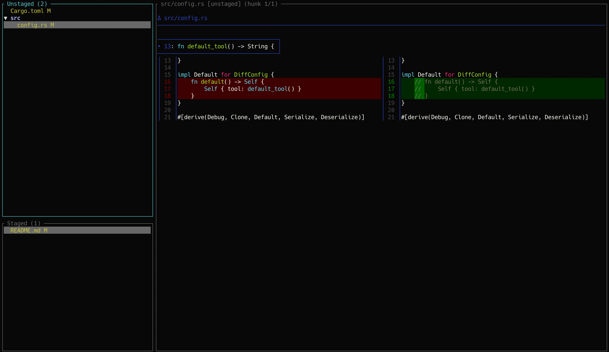

# diffview

A terminal UI tool for visually reviewing git diffs and interactively staging changes.



## Installation

Requires the Rust toolchain (rustc 1.88 or later).

```bash
# Clone the repository
git clone <repository-url>
cd diffview

# Build in release mode
cargo build --release

# Optionally add to PATH
cp target/release/diffview ~/.local/bin/
```

## Usage

```bash
# Open the git repository in the current directory
diffview

# Open a specific commit diff (read-only)
diffview 891c1b80075d926818782019351d89aa8fe4ac96

# Specify a diff tool
diffview --tool delta
diffview --tool difftastic
diffview --tool raw        # default

# Specify repository path explicitly
diffview --path /path/to/repo
diffview --path /path/to/repo 891c1b80075d926818782019351d89aa8fe4ac96
```

## Key Bindings

### Global

| Key     | Action                             |
| ------- | ---------------------------------- |
| `h` `l` | Switch focus between tree and diff |
| `r`     | Refresh to latest git state        |
| `?`     | Show key binding help              |
| `q`     | Quit                               |

### File Tree (left pane)

| Key       | Action                          |
| --------- | ------------------------------- |
| `j` / `↓` | Move down                       |
| `k` / `↑` | Move up                         |
| `l`       | Show diff for the selected file |
| `Enter`   | Stage/Unstage selected file/dir |
| `c`       | Copy selected file path         |

> Commit mode (`diffview <REV>`) is read-only: `Enter` opens diff, no stage/unstage operations.

### Diff View (right pane)

| Key       | Action                  |
| --------- | ----------------------- |
| `j` / `↓` | Scroll down one line    |
| `k` / `↑` | Scroll up one line      |
| `Ctrl+D`  | Scroll down half a page |
| `Ctrl+U`  | Scroll up half a page   |
| `g`       | Jump to top             |
| `G`       | Jump to bottom          |
| `n`       | Jump to next hunk       |
| `p`       | Jump to previous hunk   |
| `v`       | Enter line-select mode  |

### Line-Select Mode (started with `v`)

| Key       | Action                       |
| --------- | ---------------------------- |
| `j` / `k` | Move cursor                  |
| `Enter`   | Stage/Unstage selected lines |
| `v`       | Exit line-select mode        |

> Line-select mode is unavailable in commit mode.

## File Status Indicators

| Symbol | Color    | Meaning             |
| ------ | -------- | ------------------- |
| `M`    | Yellow   | Modified            |
| `A`    | Green    | Added               |
| `D`    | Red      | Deleted             |
| `?`    | Gray     | Untracked           |
| `U`    | Red bold | Unmerged (conflict) |

## Diff Tools

### raw (default)

Displays the raw `git diff HEAD` output with syntax highlighting.
All operations (hunk / line level) are available.

### delta

Requires [delta](https://github.com/dandavison/delta) to be installed.

```bash
brew install git-delta
diffview --tool delta
```

Your `~/.gitconfig` `[delta]` settings (syntax highlighting, themes, etc.) are automatically applied.

### difftastic

Requires [difftastic](https://github.com/wilfred/difftastic) to be installed.

```bash
brew install difftastic
diffview --tool difftastic
```

> **Note:** Since difftastic produces AST-based diffs, hunk / line level staging is not available. Only file-level operations are supported.

## Configuration

Settings can be specified in `~/.config/diffview/config.toml`.

```toml
[diff]
# "raw" | "delta" | "difftastic"
tool = "raw"
```

Command-line arguments take precedence over the configuration file.

## Tech Stack

| Purpose       | Crate                                                                                                      |
| ------------- | ---------------------------------------------------------------------------------------------------------- |
| TUI           | [ratatui](https://github.com/ratatui-org/ratatui) + [crossterm](https://github.com/crossterm-rs/crossterm) |
| ANSI parsing  | [ansi-to-tui](https://github.com/uttarayan21/ansi-to-tui)                                                  |
| CLI           | [clap](https://github.com/clap-rs/clap)                                                                    |
| Async runtime | [tokio](https://tokio.rs/)                                                                                 |
| Config        | [serde](https://serde.rs/) + [toml](https://github.com/toml-rs/toml)                                       |
